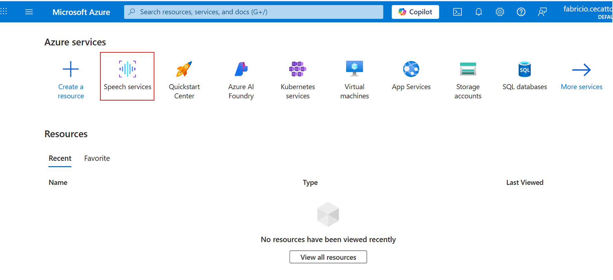
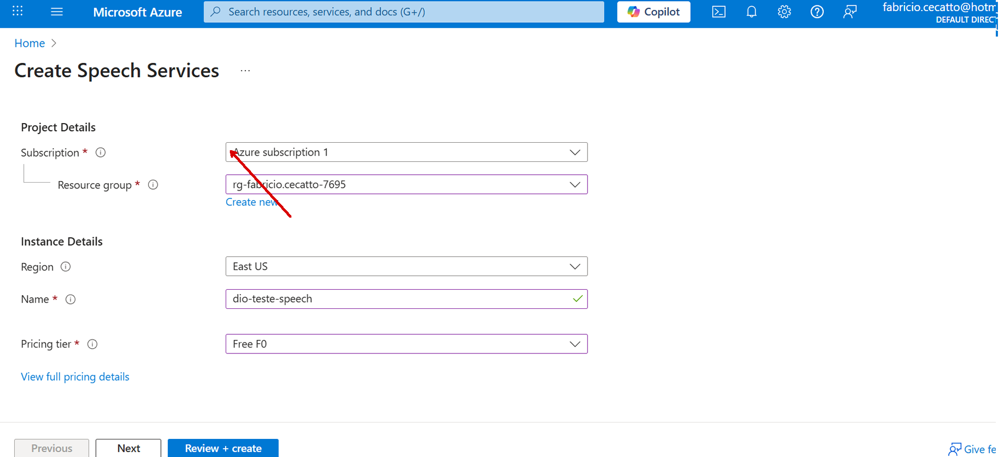
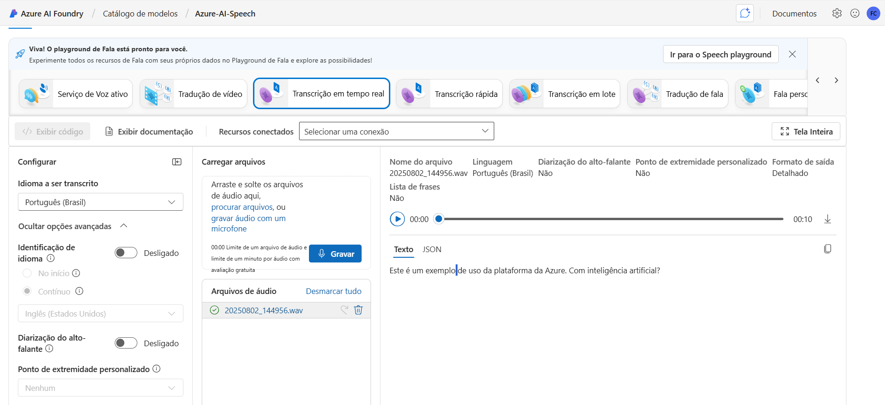
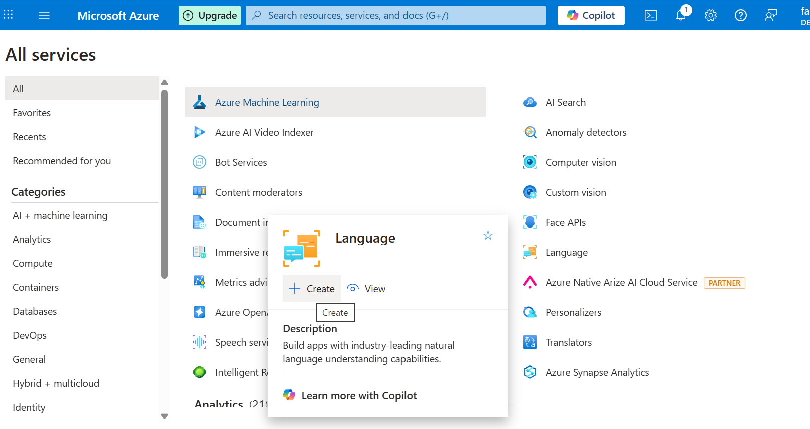
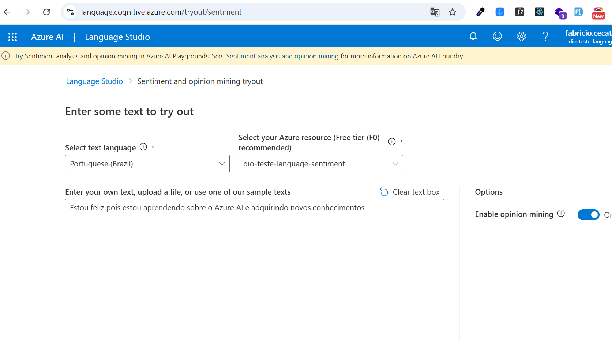
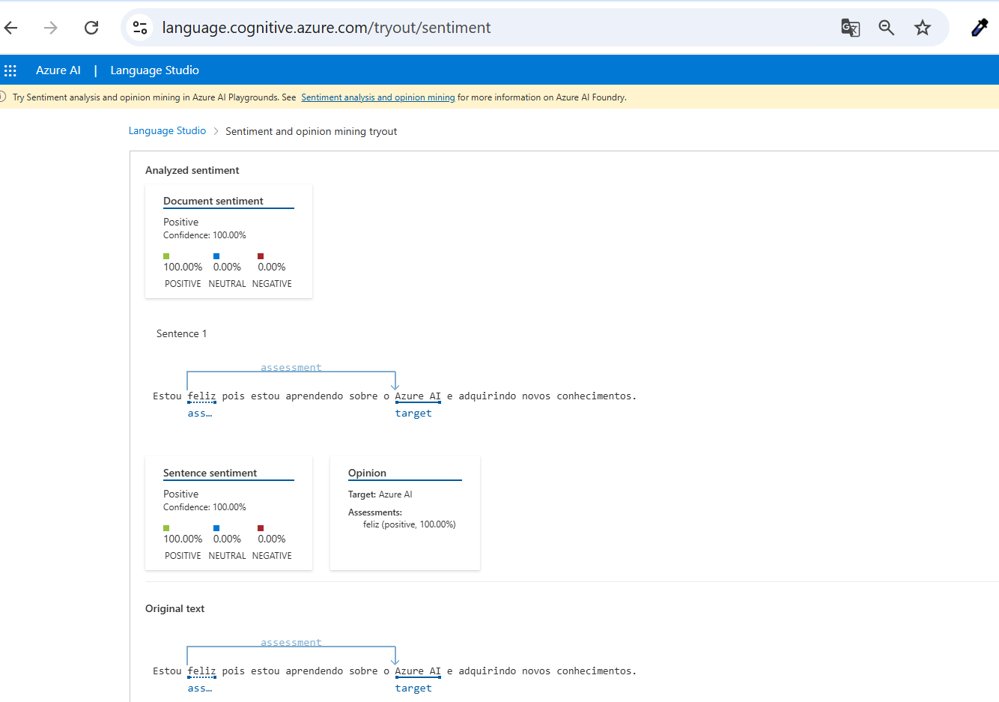

# Lab Project: Análise de Sentimentos com Language Studio no Azure AI

Esse projeto de uso do Azure AI faz parte do Bootcamp Avanade - Back-end com .NET e IA da DIO.

# Descrição do Desafio

Este laboratório tem como propósito explorar e aprimorar o uso das plataformas Azure Speech Studio e Language Studio, com foco na análise de fala e processamento de linguagem natural. A proposta é desenvolver competências práticas na criação de soluções inteligentes baseadas em IA, voltadas para voz e linguagem.  

# Azure AI Speech

O serviço de IA do Azure transcreve fala em texto e texto em fala audível. Você pode usar a IA para criar um aplicativo que transcreva notas de reunião ou gere texto a partir da gravação de entrevistas.

# Language Studio

O language Studio permite criar, treinar e testar soluções de inteligência artificial voltadas para linguagem natural. Com ele você pode fazer analise de textos (Detectar sentimentos, extrair frases-chave, identificar entidades nomeadas etc), reconhecimento de padrões, classificação personalizada, identificar idiomas,  traduções entre outros recursos.

### Como testar 

Para fazer testes tanto no AI Speech quanto no Language Studio é preciso ter uma conta criada no portal do Azure. 

### 1 - Criar um recurso na Azure

Para iniciar acesse o [portal do Azure](https://portal.azure.com) https://portal.azure.com e entre com sua conta. Após isso, crie um recurso de Speech em "Speech Services" configurando os campos exigidos.

### 2 - Acesse o Azure Speech Studio

Acesse o [portal do Azure Speech Studio](https://speech.microsoft.com)  https://speech.microsoft.com e faça o login com sua conta Azure.
Escolha a opção  Transcrição em tempo real. Para testar a transcrição você pode, fazer upload de um arquivo de áudio (.wav, .mp3) ou usar o microfone para gravar diretamente. O Speech Studio vai mostrar a transcrição e permitir ajustes.

### 2.1 - Transcrição em tempo real

Entre as diversas opções de recursos de fala temos a transcrição em tempo real na qual você pode gravar ou importar um áudio para ser transcrito em formato texto ou em JSON.

### 3 - Acesse o Language Studio

Acesse o [Language Studio](https://language.azure.com) https://language.azure.com, faça login com sua conta Azure e escolha o recurso de linguagem. Caso já tenha criado um recurso de Azure Language, selecione-o, senão, configure-o. Escolha a opção de Ánalise de Texto e Ánalise de Sentimento. Digite uma frase contendo um sentimento e clique em Run para ver os resultados.  

# Integrações

Também é possível também fazer integrações com aplicações a serem desenvolvidas (como por exemplo C#, Python etc) instalando o SDK do Azure Speech. Esse tópico não faz parte do desafio e serve apenas de informação. 